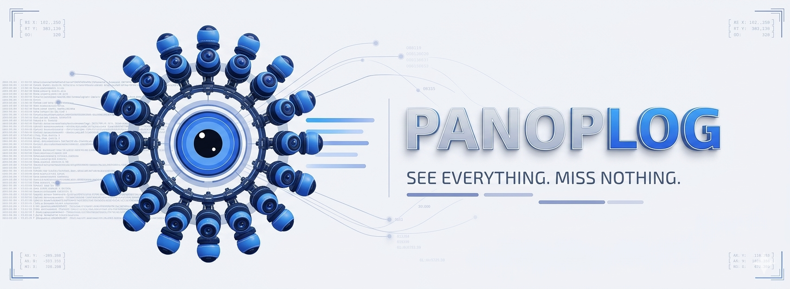
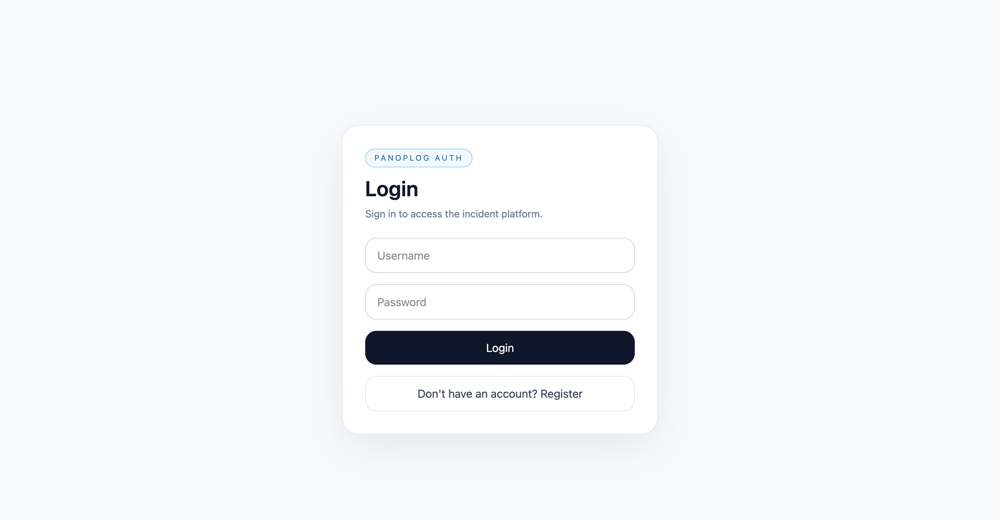
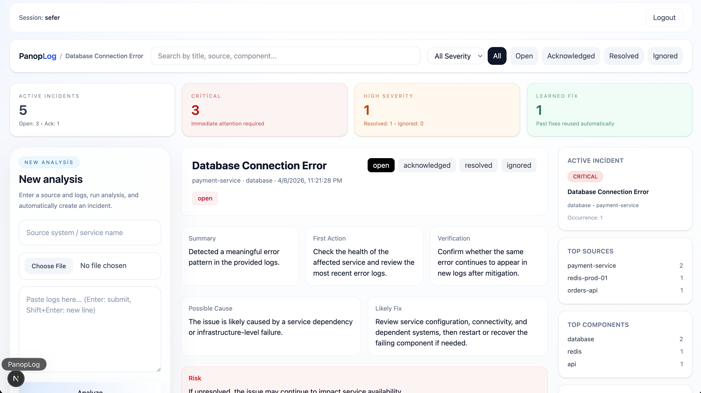
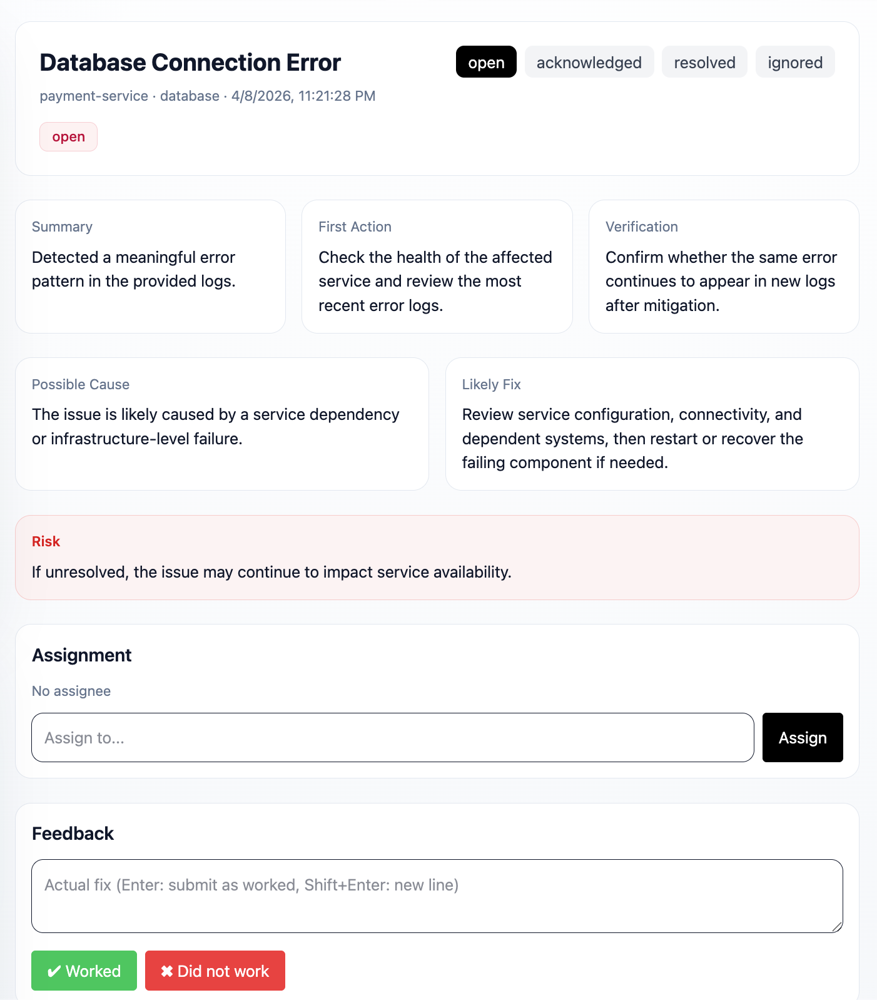
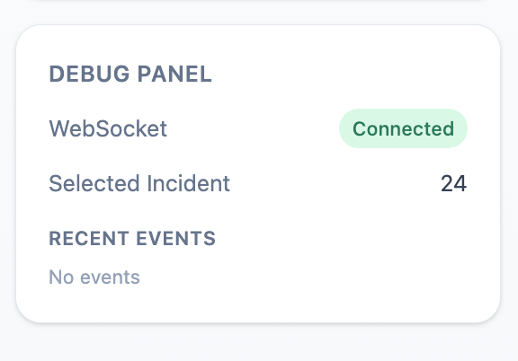

<p align="center">
  
</p>

<h1 align="center">Panoplog</h1>

<p align="center">
  See everything. Miss nothing.
</p>

<p align="center">
  AI-powered incident detection, realtime response, and ops dashboard
</p>

---

## 🚀 Overview

Panoplog is an AI-powered incident management platform.

It analyzes logs, detects incidents, deduplicates recurring issues, and provides real-time operational visibility.

---

## ✨ Features

- AI-powered log analysis
- Automatic incident creation
- Severity classification
- Deduplication (fingerprint + semantic)
- Realtime updates via WebSocket
- Feedback-driven fix learning
- Notes, assignment, and lifecycle tracking
- Discord & Google Chat notifications

---

## 📸 Screenshots

### Login


### Dashboard


### Incident Detail


### Debug Panel (Realtime WebSocket Events)


---

## 🏗️ Tech Stack

Frontend:
- Next.js
- TypeScript
- Tailwind

Backend:
- FastAPI
- SQLite
- OpenAI API

Realtime:
- WebSocket

---

## ⚙️ Run Locally

### Backend

```bash
cd backend
source venv/bin/activate
python3 -m uvicorn main:app --reload --port 8001